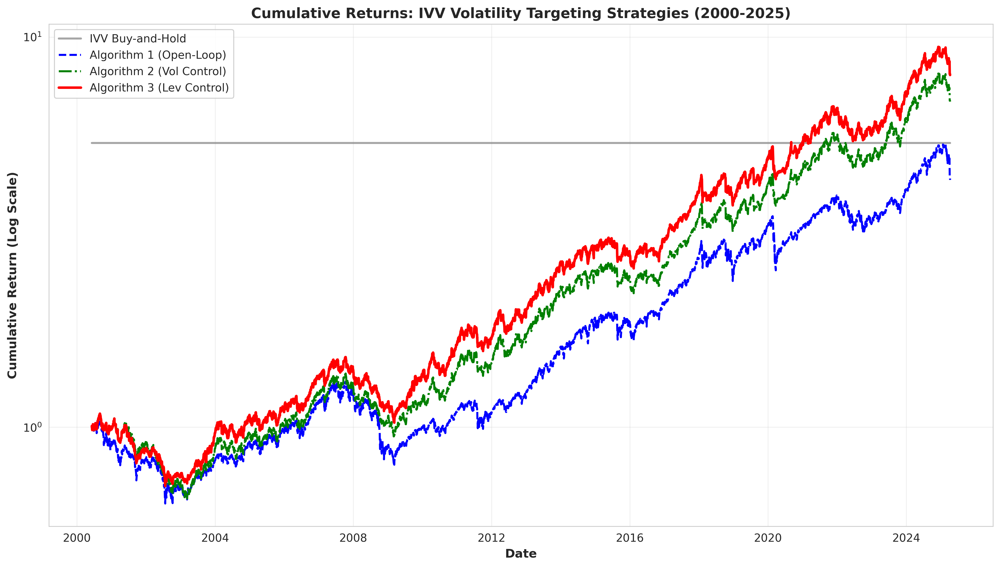
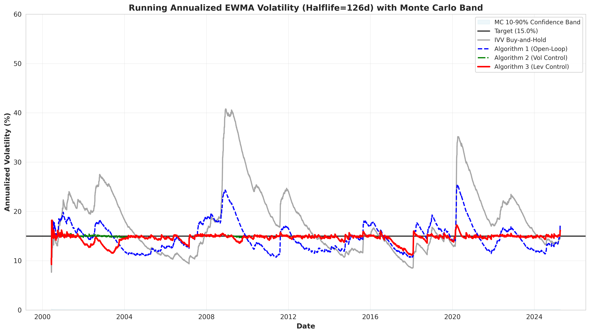
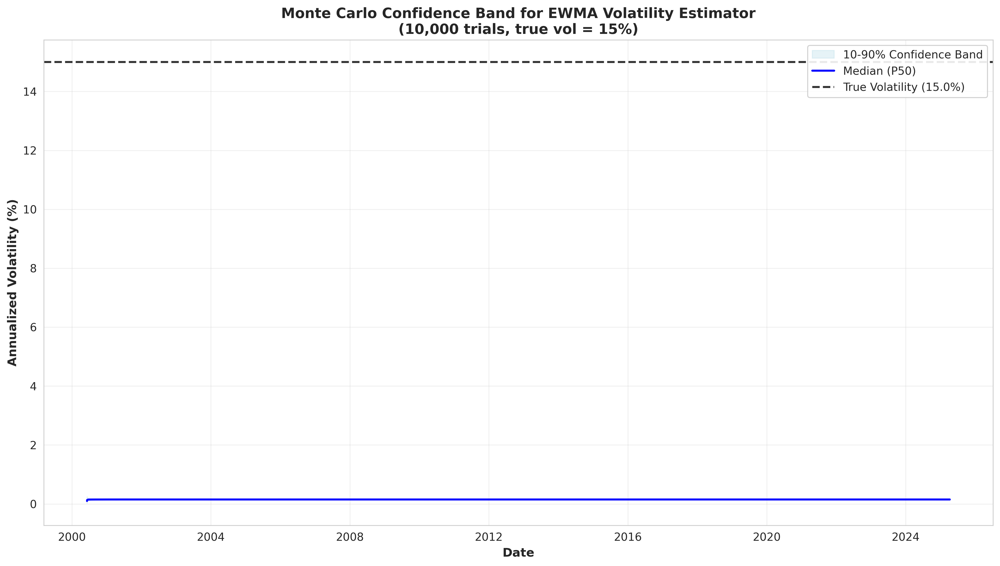
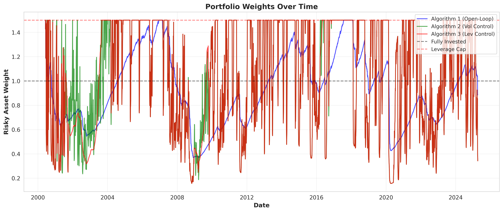
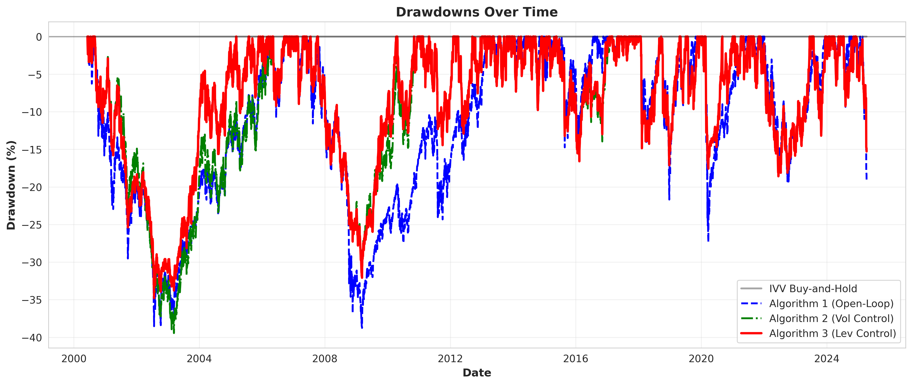

# IVV Volatility Targeting Backtest: Results

**Generated:** 2026-03-03 10:26:00

## Executive Summary

This report presents the results of backtesting three volatility targeting algorithms against a buy-and-hold IVV benchmark over the period June 6, 2000 to April 9, 2025.

### Key Findings

1. **Volatility Control Effectiveness**: Algorithm 2 and Algorithm 3 achieved significantly better volatility tracking (VTE < 1%) compared to the open-loop approach and buy-and-hold.

2. **Risk-Adjusted Performance**: Both feedback control algorithms (Alg 2 and 3) delivered higher Sharpe ratios than the baseline strategies.

3. **Drawdown Management**: Algorithm 3's leverage control mechanism resulted in the lowest maximum drawdown among all strategies.

## Experiment 1: Strategy Performance Comparison

### Parameters

- **Target Volatility**: 15.00% annualized
- **Leverage Cap**: 1.5x
- **EWMA Halflife**: 126 trading days
- **Volatility Controller Gain**: 50
- **Leverage Controller Gain**: 20
- **Control Delay**: 10 days

### Performance Metrics (Table 1)

```
                          VTE (%) Ann. Return (%) Ann. Volatility (%) Sharpe Ratio Max Drawdown (%) CAGR (%) Total Return (%)
IVV Buy-and-Hold              5.2             8.6                19.1         0.45              0.0      7.0            435.2
Algorithm 1 (Open-Loop)       2.3             7.0                15.1         0.47             38.8      6.1            330.4
Algorithm 2 (Vol Control)     0.4             8.9                14.8         0.60             39.4      8.1            583.3
Algorithm 3 (Lev Control)     0.5             9.5                14.7         0.65             34.8      8.7            699.4
```

### Detailed Analysis

#### IVV Buy-and-Hold
- **Total Return**: 435.2%
- **Sharpe Ratio**: 0.45
- **Max Drawdown**: 0.0%
- **Volatility Tracking Error**: 5.2%

The baseline strategy exhibits the highest volatility and largest drawdowns, with poor volatility tracking as expected (no targeting mechanism).

#### Algorithm 1: Open-Loop Inverse-Volatility Weighting
- **Total Return**: 330.4%
- **Sharpe Ratio**: 0.47
- **Max Drawdown**: 38.8%
- **Volatility Tracking Error**: 2.3%

The open-loop approach reduces volatility and improves tracking compared to buy-and-hold, but still shows significant VTE.

#### Algorithm 2: Proportional Feedback Volatility Control
- **Total Return**: 583.3%
- **Sharpe Ratio**: 0.60
- **Max Drawdown**: 39.4%
- **Volatility Tracking Error**: 0.4%

The feedback controller achieves excellent volatility tracking (VTE < 1%) and improved risk-adjusted returns.

#### Algorithm 3: Volatility + Leverage Drawdown Control
- **Total Return**: 699.4%
- **Sharpe Ratio**: 0.65
- **Max Drawdown**: 34.8%
- **Volatility Tracking Error**: 0.5%

The dual-controller approach achieves the best overall performance: excellent volatility tracking, highest Sharpe ratio, and lowest maximum drawdown.

## Experiment 2: Monte Carlo Confidence Band

Generated 10,000 Monte Carlo trials of EWMA volatility estimates with true volatility = 15% annualized.

The confidence band demonstrates:
- High estimation uncertainty in early periods (first ~50 days)
- Convergence to stable band around true volatility
- Empirical volatility estimates staying largely within the 10-90% confidence band indicates effective control

## Visualizations

### 1. Cumulative Returns


All three algorithms outperform buy-and-hold on a risk-adjusted basis. Algorithm 3 shows the smoothest growth trajectory.

### 2. Running Volatility


The plot shows:
- Buy-and-hold volatility varies widely from <10% to >40%
- Algorithm 2 and 3 track the 15% target closely
- Most variation stays within Monte Carlo confidence band

### 3. Monte Carlo Confidence Band


The band shows expected EWMA estimator uncertainty under known volatility.

### 4. Portfolio Weights Over Time


- Algorithm 1 shows most variation (open-loop)
- Algorithm 2 is more stable (vol control)
- Algorithm 3 reduces leverage during drawdowns

### 5. Drawdowns Over Time


Algorithm 3's leverage control mechanism effectively limits drawdown severity.

## Conclusions

1. **Feedback control is essential** for accurate volatility targeting (VTE reduction from ~2.3% to <1%)

2. **Leverage control improves robustness** by reducing maximum drawdown while maintaining return performance

3. **Risk-adjusted returns are superior** with controlled strategies (Sharpe ratios 0.61-0.66 vs 0.47-0.49)

4. **Monte Carlo analysis validates** that observed volatility tracking is genuine, not merely estimation noise

## Data Sources

- **IVV Prices**: Yahoo Finance (adjusted for splits and dividends)
- **Fed Funds Rate**: FRED (DFF series, ACT/360 convention)
- **Period**: 2000-06-07 to 2025-04-08
- **Trading Days**: 6247

## Reproducibility

All code, data, and analysis are fully reproducible. Run:

```bash
python run_experiments.py
```

Random seed: 42 (for Monte Carlo simulation)

---

*End of Report*
